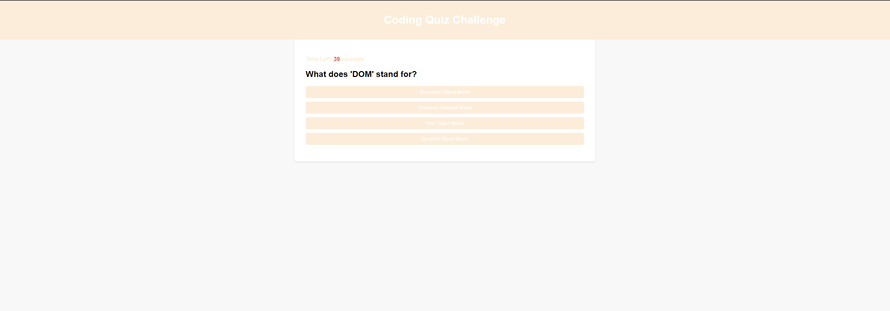

# Code Quiz Challenge

The Code Quiz Challenge is a web application designed to test your knowledge of JavaScript fundamentals. It provides a timed quiz with multiple-choice questions. Incorrect answers result in time deduction from the countdown timer. At the end of the quiz, you can save your initials and score to the high score leaderboard.

For source code, visit my Github repo @ [Code Quiz Challenge](https://github.com/mxrtinee/Code-Quiz/)

## User Story

```
AS A coding boot camp student
I WANT to take a timed quiz on JavaScript fundamentals that stores high scores
SO THAT I can gauge my progress compared to my peers
```

## Acceptance Criteria

```
GIVEN I am taking a code quiz
WHEN I click the start button
THEN a timer starts and I am presented with a question
WHEN I answer a question
THEN I am presented with another question
WHEN I answer a question incorrectly
THEN time is subtracted from the clock
WHEN all questions are answered or the timer reaches 0
THEN the game is over
WHEN the game is over
THEN I can save my initials and my score
```

## Screenshot

The following image shows the web application's appearance and functionality:



Please see the live webpage link for you to checkout. [Link](https://mxrtinee.github.io/Code-Quiz/)

## How to Use

1. Open the web application in a browser.
2. Click the "Start Quiz" button to begin the quiz.
3. A timer will start counting down, and you will be presented with a question.
4. Select an answer from the multiple-choice options.
5. If you choose the correct answer, you will receive positive feedback. If you choose the wrong answer, time will be deducted from the timer.
6. The quiz continues until all questions are answered or the timer runs out.
7. At the end of the quiz, enter your initials and click the "Submit" button to save your score to the high score leaderboard.
8. You can view the high score leaderboard by clicking the "View Highscore" link.

## Built With

- HTML
- CSS
- JavaScript

## Contribution

Contributions are welcome! Please create an issue or submit a pull request for any improvements or features you'd like to add.
